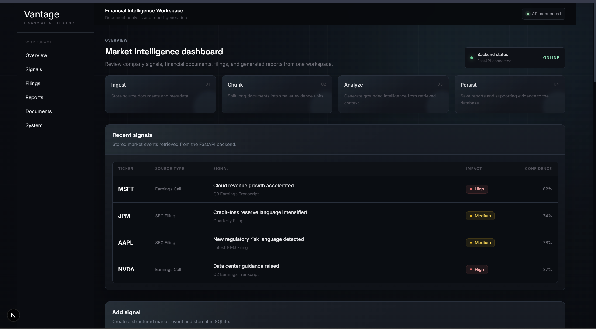
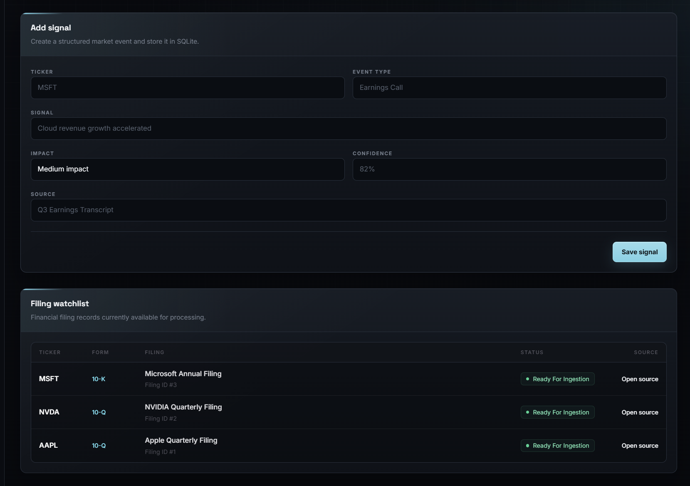
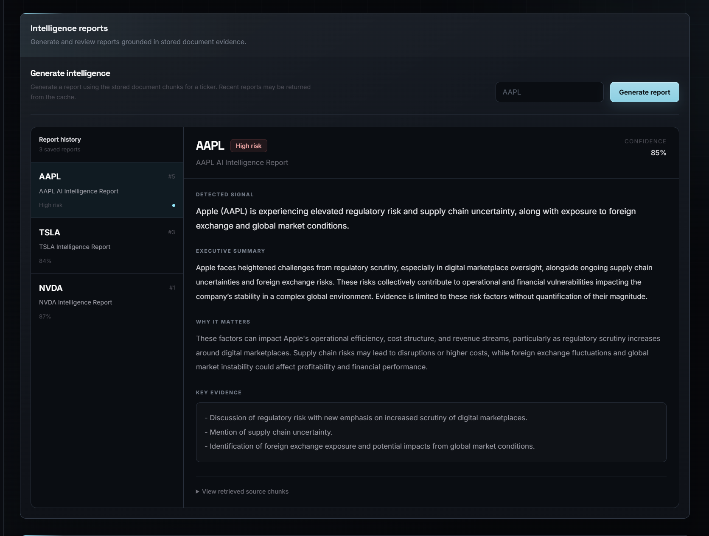
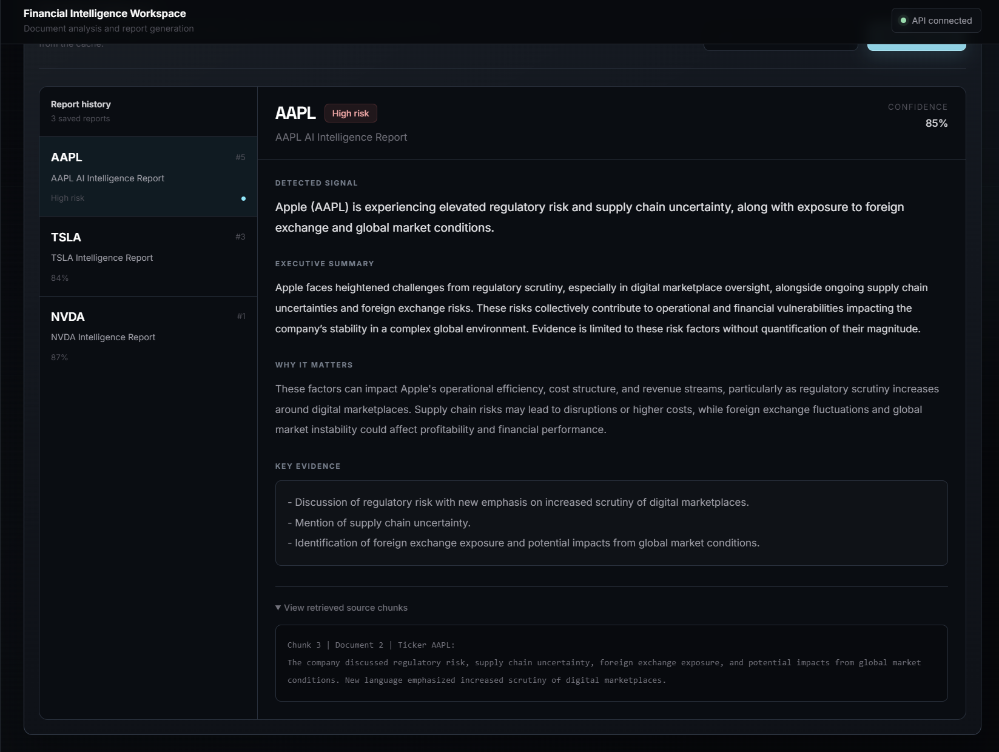
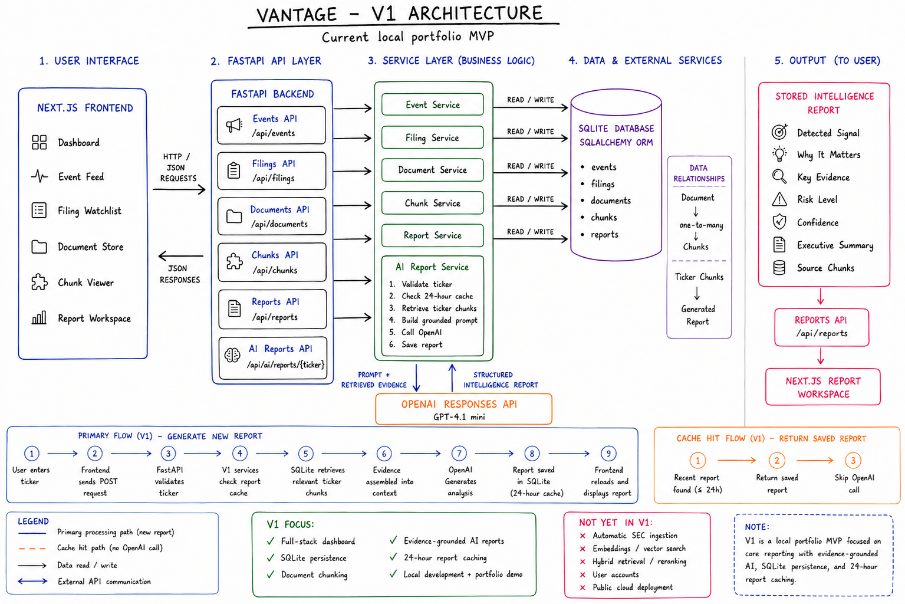

# Vantage

Vantage is a full-stack financial document intelligence platform that stores financial documents, divides them into retrievable chunks, and generates evidence-grounded company intelligence reports.

The project was built to explore backend architecture, document-processing pipelines, AI API integration, database persistence, and full-stack application development.

## Overview

Vantage provides a central workspace for:

* tracking company-related signals
* reviewing filing metadata
* storing financial documents
* processing documents into chunks
* generating AI-assisted intelligence reports
* preserving the evidence used to create each report

Instead of functioning as a general-purpose financial chatbot, Vantage is designed around a structured document-processing workflow.

## Current V1 Workflow

```text
Financial document
        ↓
Stored in SQLite
        ↓
Document chunking
        ↓
Ticker-based chunk retrieval
        ↓
OpenAI report generation
        ↓
Report saved to database
        ↓
Displayed in Next.js dashboard
```

## Features

### Financial event tracking

Users can create structured company signals containing:

* ticker
* event type
* signal description
* impact level
* confidence
* source

### Filing watchlist

The dashboard displays stored filing metadata, including:

* company ticker
* filing type
* filing title
* processing status
* source location

### Document storage

Financial documents are stored with their:

* ticker
* document type
* title
* source URL
* raw text
* processing status

### Document chunking

Stored documents can be divided into smaller chunks for later retrieval and AI analysis.

Chunks preserve:

* source document ID
* ticker
* chunk position
* text
* estimated token count

### AI intelligence reports

Vantage retrieves stored chunks for a ticker and sends the evidence to the OpenAI API.

The generated report includes:

* detected signal
* why the signal matters
* supporting evidence
* risk level
* confidence
* executive summary

Reports and their source evidence are saved in SQLite.

### Report caching

Recent reports are cached for 24 hours.

Repeated requests for the same ticker return the existing report instead of making an unnecessary OpenAI API request.

### Input validation and error handling

The report endpoint validates ticker formats and returns controlled HTTP responses for:

* invalid input
* missing document chunks
* OpenAI authentication errors
* API quota errors
* provider connection failures
* database failures

### Automated testing

The backend includes Pytest integration tests for:

* root and health endpoints
* API status
* document retrieval
* report retrieval
* ticker validation
* missing document data

## Technology Stack

### Frontend

* Next.js
* React
* TypeScript
* Tailwind CSS

### Backend

* Python
* FastAPI
* SQLAlchemy
* Pydantic
* OpenAI API

### Database

* SQLite

### Testing and Development

* Pytest
* HTTPX
* Git

## Project Structure

```text
Vantage/
├── app/
│   ├── ApiStatus.tsx
│   ├── ChunkViewer.tsx
│   ├── DocumentFeed.tsx
│   ├── EventFeed.tsx
│   ├── FilingFeed.tsx
│   ├── ReportFeed.tsx
│   ├── add-event-form.tsx
│   ├── globals.css
│   ├── layout.tsx
│   └── page.tsx
│
├── backend/
│   ├── app/
│   │   ├── api/
│   │   ├── models/
│   │   ├── schemas/
│   │   ├── services/
│   │   └── database.py
│   ├── tests/
│   ├── main.py
│   ├── pytest.ini
│   ├── requirements.txt
│   └── .env.example
│
├── README.md
└── package.json
```

## Backend Architecture

The FastAPI backend is divided into four primary layers.

### API layer

```text
backend/app/api/
```

Receives HTTP requests, validates route-level inputs, calls service functions, and returns HTTP responses.

### Service layer

```text
backend/app/services/
```

Contains business logic such as:

* document chunking
* database retrieval
* report caching
* OpenAI report generation
* seed data creation

### Model layer

```text
backend/app/models/
```

Defines SQLAlchemy database models for:

* events
* filings
* documents
* chunks
* reports

### Schema layer

```text
backend/app/schemas/
```

Defines Pydantic request and response structures.

## Local Setup

### Requirements

Install:

* Node.js
* Python 3.11 or newer
* Git

### 1. Clone the repository

```bash
git clone <repository-url>
cd vantage
```

### 2. Install frontend dependencies

```bash
npm install
```

### 3. Create the backend virtual environment

```bash
cd backend
python -m venv venv
```

Activate it on Windows:

```powershell
.\venv\Scripts\Activate.ps1
```

Activate it on macOS or Linux:

```bash
source venv/bin/activate
```

### 4. Install backend dependencies

```bash
python -m pip install -r requirements.txt
```

### 5. Configure environment variables

Create:

```text
backend/.env
```

Use the example file:

```env
OPENAI_API_KEY=your_openai_api_key_here
```

The real `.env` file is excluded from Git.

### 6. Start the backend

From the `backend` folder:

```bash
python -m uvicorn main:app --reload --port 8000
```

Backend:

```text
http://localhost:8000
```

Swagger documentation:

```text
http://localhost:8000/docs
```

### 7. Start the frontend

From the project root:

```bash
npm run dev
```

Frontend:

```text
http://localhost:3000
```

## Running Tests

From the backend folder:

```bash
python -m pytest
```

## Production Build

From the project root:

```bash
npm run build
```

## Security Considerations

Vantage V1 is currently intended as a local development and portfolio project.

The project already includes:

* environment-based API key storage
* ignored secret files
* ORM-based database queries
* ticker validation
* controlled backend error responses
* AI report caching
* maximum chunk retrieval limits

Before any open public deployment, the following should be added:

* authentication
* authorization
* per-user quotas
* API rate limiting
* request-size limits
* production secret management
* PostgreSQL
* HTTPS
* restricted CORS configuration
* centralized logging
* usage and cost monitoring
* background job processing
* dependency vulnerability scanning

## Dashboard



## Signals and Filings



## Intelligence Reports



## Document Processing



## Architecture



## V1 Limitations

The current version uses seeded local data and manual document processing.

V1 does not yet include:

* automatic SEC filing ingestion
* live filing monitoring
* filing-to-filing change detection
* embeddings
* vector search
* hybrid retrieval
* reranking
* user accounts
* public multi-tenant deployment

## Roadmap

### V1.5

* current versus previous filing comparison
* added, removed, and modified language detection
* evidence-linked change reports
* improved document metadata

### V2

* embedding generation
* vector search
* keyword and semantic hybrid retrieval
* reranking
* source citations
* retrieval evaluation
* cost and latency tracking

### V3

* SEC EDGAR ingestion
* scheduled document monitoring
* company watchlists
* background workers
* PostgreSQL
* Redis caching and rate limiting
* Docker
* read-only cloud deployment

## Project Motivation

Vantage was created as a flagship engineering project for backend, software engineering, and applied AI internship preparation.

The project emphasizes:

* REST API design
* modular backend architecture
* relational data modeling
* document-processing pipelines
* external API integration
* caching
* testing
* error handling
* full-stack communication
* production-oriented system design

## Disclaimer

Vantage is an educational software project.

Generated reports are based only on the supplied document evidence and should not be treated as financial or investment advice.
